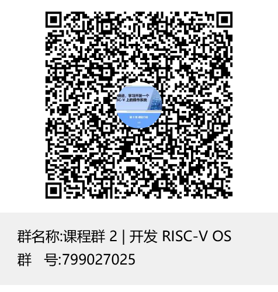

**循序渐进，学习开发一个 RISC-V 上的操作系统**

<!-- TOC -->

- [1. 简介](#1-简介)
- [2. 运行环境](#2-运行环境)
- [3. 构建和使用说明](#3-构建和使用说明)
- [4. 参考文献](#4-参考文献)

<!-- /TOC -->

# 1. 简介

本课程用于教学演示如何从零开始为 RISC-V 平台编写一个简单的操作系统内核。采用 BSD 2-Clause 许可证发布（具体请阅读本仓库根目录下的 [LICENSE 文件](./LICENSE)）。

本课程自 2021 年春季首次发布后的课程内容勘误表为本仓库根目录下的 `errata.pdf` 文件，在学习之前请先自行阅读。

如果您有任何的问题或者发现任何可疑的 bug，请通过 [Gitee 的 issue 跟踪系统](https://gitee.com/unicornx/riscv-operating-system-mooc/issues) 给我们提出报告，我们将第一时间检查并在系统中回复您。

**本课程的配套教学视频在线播放地址**: <https://www.bilibili.com/video/BV1Q5411w7z5>

欢迎加入本课程的 **学习群**，边学习边讨论：

- **QQ 学习群**

  **“课程群 2”**, 群号: **799027025**，或者扫码加入，见下：

  

  ***注意！！！：“课程群 1” 已满，请大家加入 “课程群 2”。***

- **微信学习群**

  请添加微信 fangzhang1024 （标注 【汪辰老师】）加入。

# 2. 运行环境

推荐使用 Ubuntu 20.04，Ubuntu 20.04 是目前最新的 Ubuntu 长期稳定发行版，在这个环境下安装运行环境也最简单。

有些同学反映希望仍然使用Ubuntu 18.04，因为 Ubunt 18.04 的官方源还不支持 RISC-V 的开发工具包，所以搭建环境稍微复杂一些，我写了一个简单的说明文档，感兴趣的同学可以看 [这里](./howto-run-with-ubuntu1804_zh.md)。

所有演示代码在以下环境下验证通过，请仔细核对你的 Ubuntu 版本和内核版本与以下信息是否一致。

```
$ lsb_release -a
No LSB modules are available.
Distributor ID:	Ubuntu
Description:	Ubuntu 20.04.3 LTS
Release:	20.04
Codename:	focal

$ uname -r
5.11.0-27-generic
```

目前在 Ubuntu 20.04 环境下我们可以直接使用官方提供的 GNU工具链和 QEMU 模拟器，执行如下命令在线安装即可开始试验：

```
$ sudo apt update
$ sudo apt install build-essential gcc make perl dkms git gcc-riscv64-unknown-elf gdb-multiarch qemu-system-misc
```

# 3. 构建和使用说明

- `make`：编译构建
- `make run`：启动 qemu 并运行
- `make debug`：启动调试
- `make code`：反汇编查看二进制代码
- `make clean`：清理

具体使用请参考具体子项目下的 Makefile 文件。

# 4. 参考文献

本课程的设计参考了如下网络资源，在此表示感谢 :)

- The Adventures of OS：<https://osblog.stephenmarz.com/index.html>
- mini-riscv-os: <https://github.com/cccriscv/mini-riscv-os>
- Xv6, a simple Unix-like teaching operating system：<https://pdos.csail.mit.edu/6.828/2020/xv6.html>
